# UI/UX Architektur Dokumentation - Sparkfined PWA

## 1. Einleitung & Design-Philosophie

Diese Dokumentation beschreibt die User Interface (UI) und User Experience (UX) Architektur der Sparkfined PWA. Ziel ist es, eine hochperformante, ablenkungsfreie Umgebung für Trader zu schaffen, die sowohl schnelle Datenerfassung als auch tiefgehende Analyse ermöglicht.

### 1.1 Kernprinzipien
*   **Data-First**: Der Fokus liegt auf den Handelsdaten. UI-Elemente treten in den Hintergrund.
*   **Efficiency**: Kritische Aktionen (z.B. Trade erfassen) müssen mit minimalen Klicks erreichbar sein.
*   **Progressive Disclosure**: Komplexe Informationen werden erst bei Bedarf angezeigt (z.B. Quick Add -> Detailed Edit).
*   **Mobile-Ready**: Volle Funktionalität auf Mobilgeräten für das Journaling unterwegs.

---

## 2. Design System

Das Design System basiert auf **Shadcn UI** (Radix UI Primitives) und **Tailwind CSS**, angepasst für einen modernen Financial-Look.

### 2.1 Visuelle Sprache
*   **Theme**: Dark Mode als Standard (Branchenstandard für Charting-Software), um Augenbelastung bei langer Nutzung zu reduzieren.
*   **Farbschema**:
    *   *Primary*: Akzentfarbe für Calls-to-Action.
    *   *Semantic*: 
        *   🟢 Grün (Profit/Long/Bullish)
        *   🔴 Rot (Loss/Short/Bearish)
        *   🟡 Gelb (Warning/Pending)
    *   *Backgrounds*: Abgestufte Grautöne (`zinc` palette) zur Hierarchisierung von Flächen (Cards vs. Background).
*   **Typografie**: 
    *   Sans-Serif (Inter/Geist) für UI-Texte.
    *   **Monospace** für numerische Daten (Preise, PnL), um tabellarische Lesbarkeit zu gewährleisten.

### 2.2 Iconografie
*   Verwendung von **Lucide React** Icons.
*   Einheitliche Strichstärke und Größe.
*   Semantischer Einsatz (z.B. Pfeile für Trends).

---

## 3. Information Architecture (IA)

Die Anwendung ist hierarchisch strukturiert, mit flacher Navigation auf der obersten Ebene.

### 3.1 Sitemap

### 3.2 Navigations-Struktur

*   **Primäre Navigation (Immer sichtbar/erreichbar)**:
    *   Dashboard
    *   Journal
    *   Chart
    *   Learn
    *   Settings
*   **Sekundäre Navigation (Kontextabhängig oder versteckt)**:
    *   Watchlist (Sidebar Toggle / Mobile Menu)
    *   Oracle (Sidebar Toggle / Mobile Menu)
    *   Replay (Sub-Feature von Chart)

---

## 4. Core User Flows

### 4.1 Trade Logging Flow (Erfassung)

Ein zweistufiger Prozess, um Reibung zu minimieren.

```mermaid
sequenceDiagram
    participant User
    participant QuickAdd as Quick Add Modal
    participant Store as Local Store
    participant Detailed as Detailed View
    
    rect rgb(20, 20, 30)
    Note over User, QuickAdd: Phase 1: Während dem Trading
    User->>QuickAdd: Klick "Log Trade"
    QuickAdd->>User: Zeige minimales Formular
    User->>QuickAdd: Eingabe: Asset, Dir, Price
    User->>QuickAdd: Submit
    QuickAdd->>Store: Speichere Trade (Status: Pending)
    Store-->>User: Toast "Trade Saved"
    end
    
    rect rgb(30, 30, 40)
    Note over User, Detailed: Phase 2: Post-Market Review
    User->>Detailed: Öffne Trade Details
    Detailed->>User: Zeige volles Formular
    User->>Detailed: Add Screenshots, Tags, Notes
    User->>Detailed: Save Changes
    Detailed->>Store: Update Trade (Status: Reviewed)
    end
```

### 4.2 Onboarding Flow ("First Run")

Führt neue Nutzer in die App ein und richtet die Umgebung ein.

1.  **Welcome**: Kurze Value Proposition.
2.  **Theme**: Auswahl Light/Dark (Default: Dark).
3.  **Data**: 
    *   Option A: "Start Fresh" (Neues Journal).
    *   Option B: "Import Backup" (JSON Upload).
4.  **Completion**: Weiterleitung zum Dashboard.

---

## 5. UI Patterns & Layouts

### 5.1 Layout-Struktur (AppShell)

*   **Desktop**:
    *   Collapsible Sidebar links (Navigation).
    *   Header (optional, für Breadcrumbs/Actions).
    *   Main Content Area (scrollbar).
*   **Mobile**:
    *   Header mit Hamburger-Menu/Drawer Trigger.
    *   Content Area.
    *   Fixed Bottom Navigation Bar (wichtigste Tabs).

### 5.2 Dashboard Widgets (Bento Grid)
Das Dashboard nutzt ein Grid-Layout ("Bento Box"), um verschiedene Informationsdichte-Ebenen zu kombinieren:
*   **Summary Cards**: Kleine Karten für Kennzahlen (Win Rate, PnL).
*   **List Widgets**: Mittlere Karten für letzte Aktivitäten (Recent Trades).
*   **Chart Widgets**: Große Karten für visuelle Trends (PnL Curve).
*   **Empty States**: Jedes Widget hat einen definierten "Leer-Zustand" mit Call-to-Action (z.B. "Log your first trade").

### 5.3 Feedback Mechanismen
*   **Toasts**: Für flüchtiges Feedback (Erfolg, Info). Position: Unten rechts (Desktop) / Oben (Mobile).
*   **Dialogs/Modals**: Für blockierende Aktionen (Trade Entry, Confirm Delete).
*   **Form Validation**: Inline-Fehlermeldungen unter den Feldern (Zod + React Hook Form).

---

## 6. Responsive Strategie

Die Anwendung folgt einem **Mobile-First** Ansatz im Code, aber einem **Desktop-First** Ansatz im Funktionsumfang (Chart-Analyse ist primär Desktop).

| Komponente | Desktop Verhalten | Mobile Verhalten |
| :--- | :--- | :--- |
| **Navigation** | Sidebar (Left) | Bottom Tab Bar + Drawer |
| **Datentabellen** | Vollständige Spalten, Sortierbar | Card-Listen (gestapelte Infos), reduzierte Details |
| **Modals** | Zentriertes Overlay | Fullscreen Sheet / Drawer |
| **Charts** | Interaktiv, Tooltips, Zoom | Statisch oder vereinfacht, Landscape-Mode empfohlen |
| **Watchlist** | Sidebar Panel (rechts) | Separate Page / Drawer |

## 7. Interaktions-Details

### 7.1 Eingabefelder (Forms)
*   **Autofocus**: Beim Öffnen von Modals auf das erste relevante Feld.
*   **Keyboard Navigation**: Volle Tab-Unterstützung.
*   **Smart Defaults**: Datum = Heute, Asset = Letztes benutztes (optional).

### 7.2 Listen & Filter
*   **Filter-Tabs**: Schnelles Umschalten (z.B. Alerts: All | Active | Triggered).
*   **Search**: Client-side Fuzzy Search für Listen (Trades, Watchlist).
*   **Pagination vs. Infinite Scroll**:
    *   Trades: Infinite Scroll (Performance).
    *   Alerts/Watchlist: Listenansicht (da Menge begrenzt).

---
*Dokumentstatus: Final*
*Version: 1.0*
*Datum: 29.12.2025*
